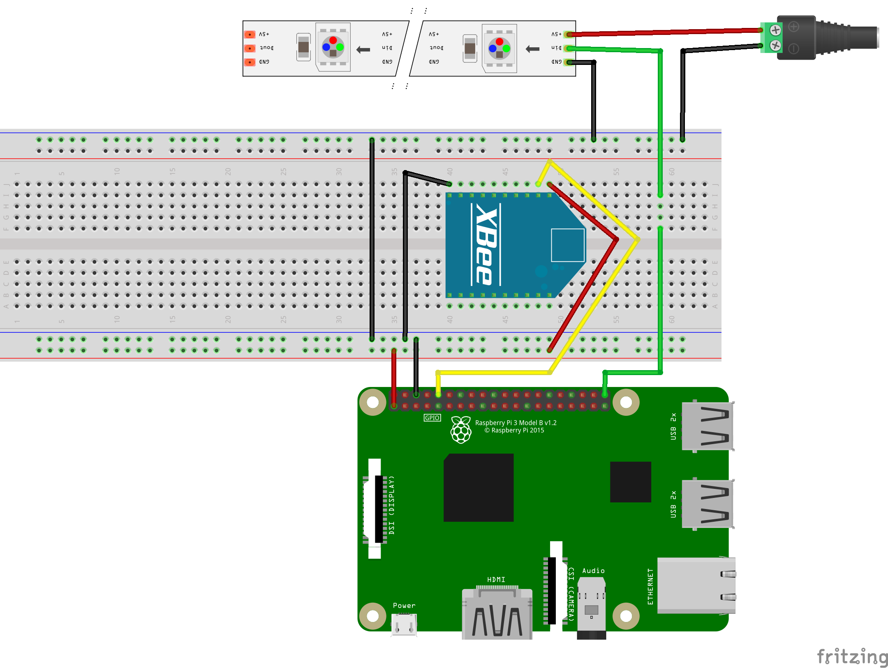

(This repo was moved from ITU's closed github)

# NodeBox_v2
Python port of NodeBox project with extended features.

Original NodeBox project by: Camilla Engbjerg Anker, Mikkel Vinter Christiansen & Mai Brandt Hartmann-Andersen.

NodeBox_v2 is distributed as a Raspbian system image. Thus everything is pre-configured and ready to go.

Download here: https://www.dropbox.com/s/og81nm1kglsjfu5/nodebox_v2_final.img?dl=0


## Dependencies

Project runs on a Raspberry Pi using python 3.6 or newer.

Follow instructions here to install the ws2812 LED driver, project uses PCM on pin 21 (physical pin 40).

https://github.com/jgarff/rpi_ws281x

Linux applications:
```bash
sudo apt install sox
```

Python libraries:
```bash
pip install pyserial
```

## Setup

The project uses the default user pi, with the pw set to 'musicbox'.



# Sample Sheets
The NodeBox maps controller inputs to sample files using a 'sample sheet' - an xml file that contains the mappings and the path to sample file.
Multiple of these can be kept on the nodebox and loaded interchangeably. They follow the following format:

Sample sheets can be generated by using the sample_sheet_generator.py, located in nodebox_v2/music_box_code/sample_sheet_generator.py
This will guide the user through the generation of sample_sheet.

Thus a general setup for the nodebox with two players would be 2-3 subsections in one sample_sheets, one for each player if they play different samples, or one for both players and then one for the backing track, typically drums etc. 

```xml
<sample_sheet>
  <backing_track>
    <sample>
      <full_path>../sound_files/drumkit/lowtom2.wav</full_path>
      <name>lowtom2</name>
      <format>.wav</format>
      <char>A</char>
    </sample>
  </backing_track>
  <default>
    <sample>
      <full_path>../sound_files/selection/backwards-ringer.aif</full_path>
      <name>backwards-ringer</name>
      <format>.aif</format>
      <char>A</char>
    </sample>
    <!-- ... more samples -->
  </default>
  <!-- ... more subsections -->
</sample_sheet>
```

# Backing Tracks
backing track .xml files simply adding backing tracks. They consist of a number of sample names from the loaded sample_sheet, for each beat.


```xml
<backing_track>
    <beat>
        <beat_number>1</beat_number>
        <sample>kick</sample>
        <sample>hihat1</sample>
    </beat>
    <beat>
        <beat_number>2</beat_number>
        <sample>snare1</sample>
    </beat>
    <!-- .. more beats-->
</backing_track>
```

# Sound Files
To play samples with the NodeBox, you need samples.. These can be created by the user, they should be about ~1 second in length. Otherwise there are many great places to download royalty free samples, like http://sampleswap.org

samples must be placed in the /nodebox_v2/sound_files/ dir, and should be arranged in directories for samples that fit together, eg. '/sound_files/drums/', so that they can be easily turned into sample_sheets.


 
